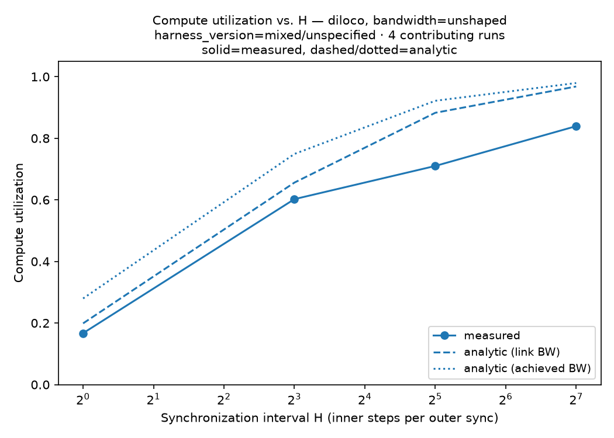

# diloco-measured

**Measured, Not Simulated — A Bandwidth-Controlled Evaluation of Semi-Synchronous LLM Training
on Commodity Ethernet.**

> Every published bandwidth-vs-synchronization curve in this literature is simulated. This
> repository contains measured ones, the code that produced them, and the discrepancy between
> the two.

**Document status:** `[CONFIRMED]` — real training measurement landed on real GPU hardware
(2026-08-14, see `CLAUDE.md` ADR-034). The figure and numbers below are real, not placeholders.
They are a **first, unshaped slice** — one bandwidth level, one repeat per `H` — not yet the
full shaped multi-bandwidth grid (`CLAUDE.md` §35 Phase 3, `M4`) that is this project's actual
headline deliverable. See "What's real so far" below for the precise scope.

👉 **Read [`PRIOR_ART.md`](PRIOR_ART.md) first.** It states exactly what is and is not novel here.

---

## The headline result so far (real, first slice — not the full grid yet)

Real DiLoCo training, 4× `g6e.2xlarge` (L40S, TCP-only interconnect, no NVLink/EFA), 30.8M
real parameters, real FineWeb-Edu data, `H ∈ {1, 8, 32, 128}`, unshaped baseline:



| H | cu_measured | cu_analytic_link | cu_analytic_achieved | discrepancy (link) |
| --- | --- | --- | --- | --- |
| 1 | 0.167 | 0.199 | 0.280 | 1.19× |
| 8 | 0.602 | 0.656 | 0.749 | 1.09× |
| 32 | 0.710 | 0.883 | 0.922 | 1.24× |
| 128 | 0.839 | 0.968 | 0.979 | 1.15× |

Measured compute utilization is **below both** analytic predictions at every `H` tested —
real hardware underperforms the literature's simulated model, in the direction the project's
pre-registered hypothesis (`CLAUDE.md` §2.7) predicted, by roughly 1.1–1.25× on link bandwidth.

A genuine, unplanned secondary finding: real NCCL all-reduce bandwidth (14.3–15.8 Gbit/s
plateau) came in **higher** than raw point-to-point `iperf3` (~9.53 Gbit/s) at the same link —
ring-topology parallelism beating a single TCP flow. That's the opposite of what one of the
pre-registered mechanisms expected, and it's recorded as a revision to that mechanism, not
swept under the rug. Full writeup: `CLAUDE.md` ADR-034.

**What this is not yet:** this slice is unshaped (no `tc` bandwidth cap), one repeat per `H`,
and driven by a hand-written `torchrun` script rather than the fully automated, gated run
lifecycle (`FR-03`). The shaped multi-bandwidth grid — the comparison that actually answers
"how much bandwidth do I need" — has not run yet. See `experiments/01_cu_grid/NOTES.md` and
ADR-034's "Not resolved" section for the complete, honest list of what's still open.

## What's real so far

| Piece | Status |
| --- | --- |
| 4× `g6e.2xlarge` + 1× `c7i.2xlarge` cluster, real AWS hardware | ✅ launched, validated, torn down after use |
| `torchft-nightly` + `torchtitan`, pinned and validated on a real L40S | ✅ ADR-032 |
| FR-01 network characterization (`iperf3` all-pairs, NCCL bandwidth curve, burst-decay probe) | ✅ `results/network/phase1-us-east-1b-20260814.json` |
| Real FineWeb-Edu data, gpt2-tokenized, staged per-node | ✅ ADR-034 |
| First real DiLoCo training measurement (`H` sweep, unshaped) | ✅ `results/raw/cu_grid-diloco-30m-h{1,8,32,128}-bwunshaped-r0.json`, ADR-034 |
| Shaped, multi-bandwidth grid (`configs/grids/phase_a.yaml`) — the actual headline deliverable | ⬜ not yet run |
| Convergence / time-to-target-loss runs | ⬜ not yet run |
| Fault injection, predictor validation | ⬜ not yet run |

## What this is

Four single-GPU EC2 nodes (`g6e.2xlarge`), connected only by TCP over ENA — no NVLink, no PCIe
peer-to-peer, no EFA. A Linux `tc` shaper converts interconnect bandwidth from a fixed hardware
property into a swept, independently *verified* experimental variable. On that rig we run DDP,
FSDP2, LocalSGD, and DiLoCo across synchronization intervals `H` and bandwidth levels, and
compare measured compute utilization against the literature's analytic model — through one
shared code path, so the comparison is defensible.

Full specification: [`CLAUDE.md`](CLAUDE.md) (the project's engineering brain — read before
changing anything).

## What this is NOT

- Not a new distributed-training algorithm.
- Not a reproduction of DiLoCo's quality results at scale.
- Not a production library. See `CLAUDE.md` §4.5 for the full non-goals list.

## Three-command reproduction (no GPU required)

```bash
git clone <repo>
cd diloco-measured
make figures   # regenerates every report figure from committed results/raw/
```

`make figures` runs with no GPU, no network access, and no AWS credentials (FR-11), and
produces the figure above (among others) from the committed `results/raw/` records — nothing
in it is hand-drawn.

## Repository map

| Path | What it is |
| --- | --- |
| `CLAUDE.md` | The master engineering specification. Read this first. |
| `PRIOR_ART.md` | What is and isn't novel here. |
| `LIMITATIONS.md` | Every known confound, stated by us. |
| `PLAYBOOK.md` | Practitioner-facing lookup: "N GPUs at X Mbit/s → use H=…" |
| `RESULTS.md` | Every run, including nulls, crashes, and abandoned lines. |
| `methods/` | How every number is computed, with every assumption listed. |
| `experiments/01_cu_grid/` | The scripts and raw telemetry behind the headline result above. |
| `src/diloco_measured/measurement/` | Needs GPUs + AWS. Never imported by analysis. |
| `src/diloco_measured/analysis/` | Pure. No GPU, no network, no credentials. |
| `results/` | Committed, append-only measurement corpus. |

## Status

Phase 1/2 in progress (`CLAUDE.md` v0.1). Network characterization (Phase 1) and a first
unshaped training slice (early Phase 2) are done and committed. The shaped multi-bandwidth
grid (Phase 3, `M4` — the project's actual headline deliverable) has not run yet. See
`CLAUDE.md` §35 for the full phase plan and §40 for remaining open questions.

## License

Apache-2.0. See [`LICENSE`](LICENSE).
