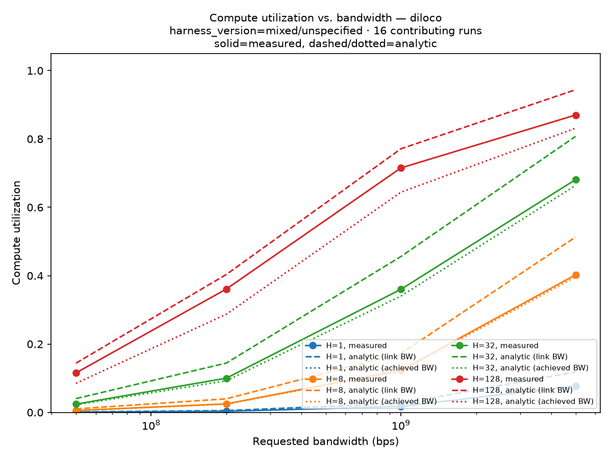
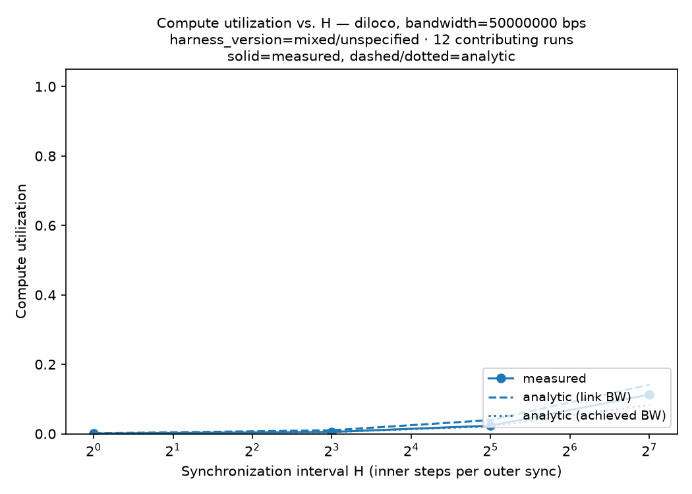
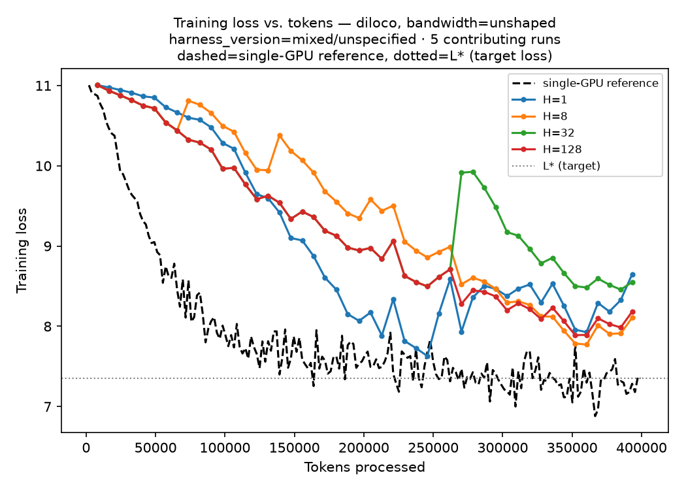

# diloco-measured

**Measured, Not Simulated — A Bandwidth-Controlled Evaluation of Semi-Synchronous LLM Training
on Commodity Ethernet.**

> Every published bandwidth-vs-synchronization curve in this literature is simulated. This
> repository contains measured ones, the code that produced them, and the discrepancy between
> the two.

**Document status:** `[CONFIRMED]` — a real, shaped, multi-bandwidth compute-utilization grid
(3 repeats/point) and a real convergence campaign have both run on real GPU hardware
(2026-08-14/15, see `CLAUDE.md` ADR-035/ADR-037). Every figure and number below is real, not a
placeholder. Scope: DiLoCo only (no DDP/FSDP2/LocalSGD driver yet), one 30.8M-parameter model.
See "What's real so far" below for the precise scope and what's still open.

👉 **Read [`PRIOR_ART.md`](PRIOR_ART.md) first.** It states exactly what is and is not novel here.

---

## The headline result

Real DiLoCo training, 4× `g6e.2xlarge` (L40S, TCP-only interconnect, no NVLink/EFA), 30.8M
real parameters, real FineWeb-Edu data, real Linux `tc` bandwidth shaping verified against a
real `iperf3` measurement before every run (FR-02) — `H ∈ {1, 8, 32, 128}` × bandwidth
`∈ {50, 200, 1000, 5000} Mbit/s`, **3 repeats per point (48 runs)**, zero shaping-gate
failures, zero crashes:



`cu_measured` (compute utilization — fraction of wall-clock time spent computing rather than
blocked on the network; median of 3 repeats):

| H | 50 Mbit/s | 200 Mbit/s | 1 Gbit/s | 5 Gbit/s |
| --- | --- | --- | --- | --- |
| 1 | 0.07% | 0.32% | 1.74% | 7.76% |
| 8 | 0.55% | 2.48% | 12.35% | 40.24% |
| 32 | 2.41% | 10.01% | 36.01% | 68.10% |
| 128 | 11.55% | 36.09% | 71.52% | 87.00% |

This is DiLoCo's core value proposition, measured directly: at `H=1` (sync every step, like
DDP) compute utilization **collapses** under bandwidth scarcity — the GPUs sit almost entirely
idle waiting on the network. At `H=128`, the same 50 Mbit/s link sustains **11.55%** CU —
roughly **165× better utilization** from amortizing the same sync cost over 128 steps instead
of 1. Measured CU is below the naive analytic model at every one of the 16 points
(`discrepancy_link` 1.08×–1.92×, worst at the low-bandwidth/low-`H` corner) — real hardware
underperforms the literature's simulated model everywhere tested, and the size of the gap
itself varies with the operating point rather than being a single constant factor. Repeat
variance is tight (< 1.5% spread on typical points), a real signal the single-repeat estimates
weren't noise-dominated. Full writeup: `CLAUDE.md` ADR-035/ADR-037.

**Required bandwidth to hit a CU target** (log-linear interpolation, never extrapolated past
the highest tested level — most cells are honestly `null` since low `H` never reaches these
targets within the tested range):

| H | 50% CU | 75% CU |
| --- | --- | --- |
| 32 | ~2.06 Gbit/s (measured) vs. ~1.26 Gbit/s (analytic) — F≈1.63× | not reached ≤5 Gbit/s |
| 128 | ~394 Mbit/s (measured) vs. ~317 Mbit/s (analytic) — F≈1.25× | ~1.55 Gbit/s vs. ~937 Mbit/s — F≈1.66× |

The same collapse, isolated to the worst bandwidth level tested (50 Mbit/s) so the `H`-axis
effect is easier to read on its own:



## Convergence: DiLoCo vs. a single-GPU reference

A single-GPU reference (plain AdamW, defines the target loss `L*`) plus DiLoCo at the same 4
`H` values × 3 bandwidth levels, all trained to a fixed 400,000-token budget:



**Honest result: none of the 12 DiLoCo configurations reached `L*` (7.352) within the token
budget** — final losses clustered 8.11–8.65 versus the reference's 7.35. This is reported as a
real null result, not smoothed over: `tttl_s` is `null` throughout (the schema-correct way to
say "target not reached," never rendered as a finite number). A genuine secondary finding: for
a fixed `H`, the final loss is bit-identical across all 3 bandwidth levels — bandwidth changes
wall-clock time (9s vs. 76s vs. 399s for the same `H=1` sweep) but not the training trajectory
itself, since it doesn't change the sequence of optimizer updates. *Why* DiLoCo converged
slower per-token than plain AdamW here is an open question this campaign doesn't resolve.

**What this is not yet:** DiLoCo only — no training driver exists yet for DDP/FSDP2/LocalSGD,
so this is not the full 4-algorithm `phase_a.yaml` comparison. A 30.8M-parameter model, not the
1B `phase_a.yaml` specifies. One seed per convergence configuration. See
`experiments/01_cu_grid/NOTES.md`, `experiments/02_convergence/NOTES.md`, and
ADR-035/ADR-037's "Not resolved" sections for the complete, honest list.

## The H-predictor (G4)

Fit on the shaped grid's repeats 0+1, held-out-validated against repeat 2 (never seen while
fitting): **`predicted_H == measured_H` at all 4 tested bandwidth levels, 0% regret.**

| Your bandwidth | Recommended H | Expected CU | In calibration domain? |
| --- | --- | --- | --- |
| 50 Mbit/s | 128 (best available) | 11.2% | No — target unreachable at any tested H |
| 200 Mbit/s | 128 (best available) | 35.4% | No — target unreachable at any tested H |
| 1 Gbit/s | 128 | 71.2% | Yes |
| 5 Gbit/s | 32 | 67.7% | Yes |

Scoped honestly: calibrated on one model size (30.8M params) and one algorithm (DiLoCo) — the
`diloco-measured plan --probe` CLI this is meant to power doesn't exist yet, and the held-out
set here is a held-out *repeat*, not a held-out *configuration*. See
`experiments/05_predictor_validation/NOTES.md` and ADR-038 for the full picture, including a
real objective-mismatch bug in the validation code caught before it was ever committed.

## What's real so far

| Piece | Status |
| --- | --- |
| 4× `g6e.2xlarge` + 1× `c7i.2xlarge` cluster, real AWS hardware | ✅ launched, validated, torn down after use |
| `torchft-nightly` + `torchtitan`, pinned and validated on a real L40S | ✅ ADR-032 |
| FR-01 network characterization (`iperf3` all-pairs, NCCL bandwidth curve, burst-decay probe) | ✅ `results/network/phase1-us-east-1b-20260814.json` |
| Real FineWeb-Edu data, gpt2-tokenized, staged per-node | ✅ ADR-034 |
| **Shaped, multi-bandwidth DiLoCo grid, 3 repeats/point** (48 real runs, G1/G2) | ✅ ADR-035/ADR-037 |
| **Convergence campaign** (single-GPU reference + 12-point DiLoCo grid, G3) | ✅ ADR-037 |
| DDP / FSDP2 / LocalSGD drivers (the rest of `phase_a.yaml`'s 4-algorithm comparison) | ⬜ not yet built |
| H-predictor (G4) — fitted, held-out-validated (0% regret, 4/4 bandwidth levels) | ✅ ADR-038 |
| Fault injection (G7), compression ablation (G6) | ⬜ not yet run |

## What this is

Four single-GPU EC2 nodes (`g6e.2xlarge`), connected only by TCP over ENA — no NVLink, no PCIe
peer-to-peer, no EFA. A Linux `tc` shaper converts interconnect bandwidth from a fixed hardware
property into a swept, independently *verified* experimental variable. On that rig we run DDP,
FSDP2, LocalSGD, and DiLoCo across synchronization intervals `H` and bandwidth levels, and
compare measured compute utilization against the literature's analytic model — through one
shared code path, so the comparison is defensible.

Full specification: [`CLAUDE.md`](CLAUDE.md) (the project's engineering brain — read before
changing anything).

## What this is NOT

- Not a new distributed-training algorithm.
- Not a reproduction of DiLoCo's quality results at scale.
- Not a production library. See `CLAUDE.md` §4.5 for the full non-goals list.

## Three-command reproduction (no GPU required)

```bash
git clone <repo>
cd diloco-measured
make figures   # regenerates every report figure from committed results/raw/
```

`make figures` runs with no GPU, no network access, and no AWS credentials (FR-11), and
produces every figure above from the committed `results/raw/` records — nothing is hand-drawn.

## Repository map

| Path | What it is |
| --- | --- |
| `CLAUDE.md` | The master engineering specification. Read this first. |
| `PRIOR_ART.md` | What is and isn't novel here. |
| `LIMITATIONS.md` | Every known confound, stated by us. |
| `PLAYBOOK.md` | Practitioner-facing lookup: "N GPUs at X Mbit/s → use H=…" |
| `RESULTS.md` | Every run, including nulls, crashes, and abandoned lines. |
| `methods/` | How every number is computed, with every assumption listed. |
| `experiments/01_cu_grid/` | The CU-grid scripts, raw telemetry, and required-bandwidth analysis. |
| `experiments/02_convergence/` | The convergence-campaign scripts and raw telemetry. |
| `src/diloco_measured/measurement/` | Needs GPUs + AWS. Never imported by analysis. |
| `src/diloco_measured/analysis/` | Pure. No GPU, no network, no credentials. |
| `results/` | Committed, append-only measurement corpus. |

## Status

Phase 2/3 in progress (`CLAUDE.md` v0.1). Network characterization (Phase 1), a real shaped
multi-bandwidth DiLoCo grid with 3 repeats (G1/G2 — Phase 2/3), and a real convergence campaign
(G3 — Phase 4) are done and committed, DiLoCo-only. Extending the same grids to
DDP/FSDP2/LocalSGD and a larger model are the main remaining work
toward the full `phase_a.yaml`/`phase_b.yaml` scope. See `CLAUDE.md` §35 for the full phase
plan and §40 for remaining open questions.

## License

Apache-2.0. See [`LICENSE`](LICENSE).
